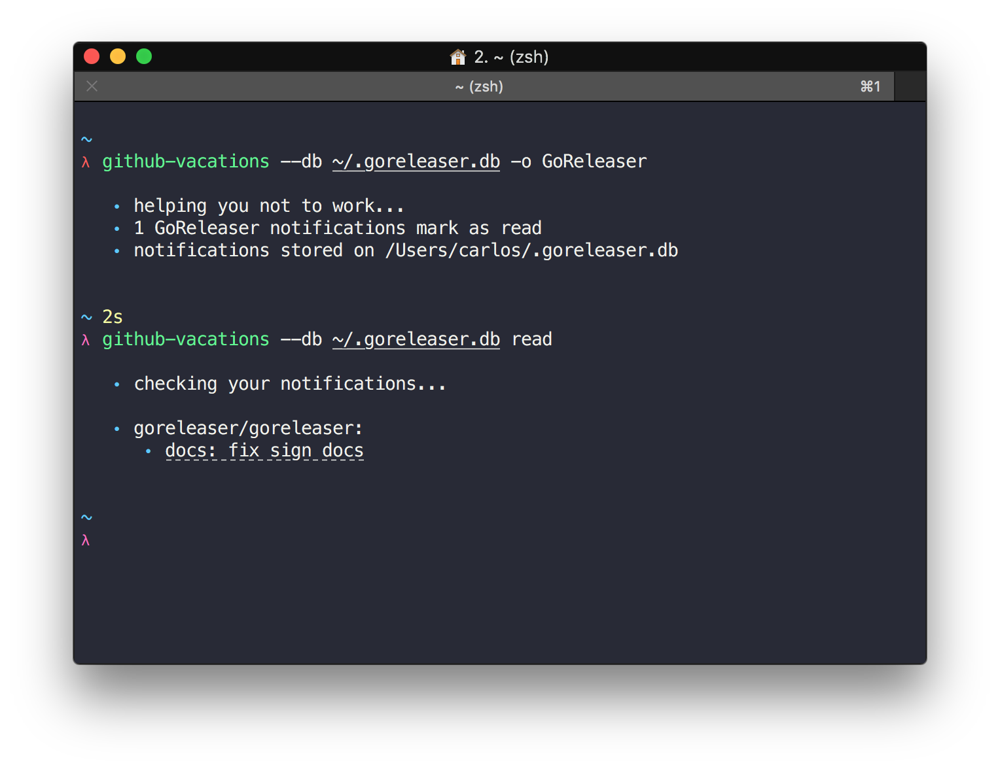

# github-vacations

[](https://github.com/caarlos0/github-vacations/releases/latest)
[](LICENSE.md)
[](https://travis-ci.org/caarlos0/github-vacations)
[](https://coveralls.io/github/caarlos0/github-vacations?branch=master)
[](https://goreportcard.com/report/github.com/caarlos0/github-vacations)
[](http://godoc.org/github.com/caarlos0/github-vacations)
[](https://saythanks.io/to/caarlos0)
[](https://github.com/goreleaser)


Automagically ignore all notifications related to work when you are on vacations

Just put the binary somewhere, export a `GITHUB_TOKEN` environment variable,
and put it in your crontab:

```crontab
* * * * * /path/to/github-vacations -t My-Github-Token -o SomeOrg > /dev/null 2>&1
```

Your notifications will be stored on `%HOME/.vacations.db`. You can read them
when you get back by using `github-vacations read`.



Enjoy your vacations! 🏖

## Install

```console
brew install caarlos0/tap/github-vacations
```
